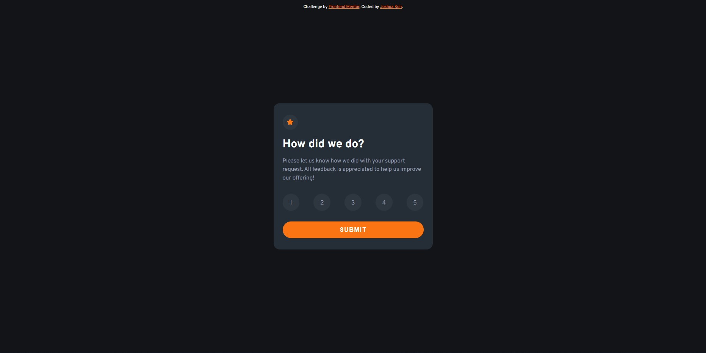
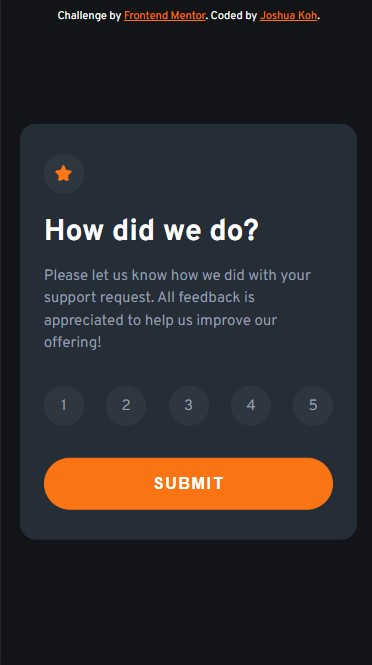

# Frontend Mentor - Interactive rating component solution

This is a solution to the [Interactive rating component challenge on Frontend Mentor](https://www.frontendmentor.io/challenges/interactive-rating-component-koxpeBUmI). Frontend Mentor challenges help you improve your coding skills by building realistic projects.

## Table of contents

- [Overview](#overview)
  - [The challenge](#the-challenge)
  - [Screenshot](#screenshot)
  - [Links](#links)
- [My process](#my-process)
  - [Built with](#built-with)
- [Author](#author)

## Overview

This is a challenge from Frontend Mentor to build a rating component which responsive in both desktop and mobile view. I'm using pure HTML and CSS to solve this challenge.

### The challenge

Users should be able to:

- View the optimal layout for the app depending on their device's screen size
- See hover states for all interactive elements on the page
- Select and submit a number rating
- See the "Thank you" card state after submitting a rating

### Screenshot

### Links

- Solution URL: [https://www.frontendmentor.io/solutions/responsive-feedback-rating-component-pure-html-css-andjs-L5XvPTHdNu](https://www.frontendmentor.io/solutions/responsive-feedback-rating-component-pure-html-css-andjs-L5XvPTHdNu)
- Live Site URL: [https://joshuakme.github.io/fm-interactive-rating-component-main/](https://joshuakme.github.io/fm-interactive-rating-component-main/)

## My process

### Built with

- Semantic HTML5 markup
- CSS custom properties
- Flexbox

## Author

- Website - [Joshua Koh](https://github.com/Joshuakme)
- Frontend Mentor - [@Joshuakme](https://www.frontendmentor.io/profile/Joshuakme)
